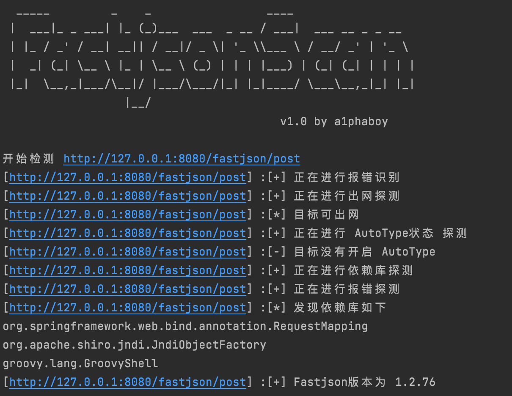
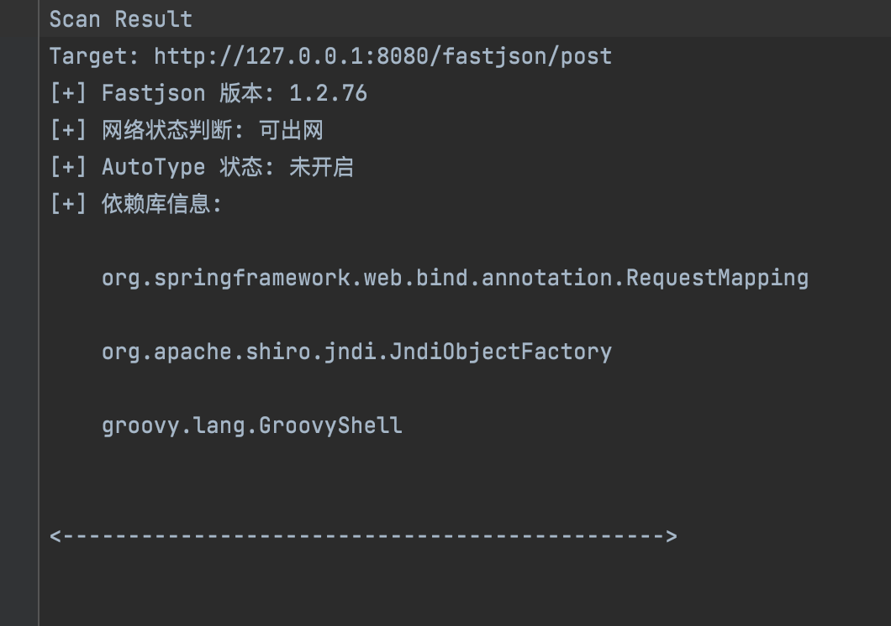

# FastjsonScan
A tool to fast detect fastjson‘s deserialize vuln

## 0x00  FastjsonScan now is public  🎉🎉🎉


### WHAT?
FastjsonExpFramework 一共分为探测、利用、混淆、bypass JDK 等多个模块，而 FastjsonScan 是其中一部分，通过报错、请求、依赖库等探测实现多方面定位 fastjson 版本

### WHY?
现有的 fastjson 扫描器无法满足迭代速度如此快的 fastjson 版本，大部分扫描器早已无人维护，已不适配高版本。我将持续优化此系列项目。

### HOW?
目前 fastjsonScan 支持
☑️支持批量接口探测
☑️1.2.83 及以下的区间探测 (主要分为 48,68,80 三大安全版本)
☑️支持报错回显探测
☑️DNS 出网检测
☑️支持 AutoType 状态检测
☑️依赖库检测
☑️延迟检测

### TODO
适配内网环境下的探测
适配 webpack 做自动化扫描
完善 DNS 回显探测依赖库的探测
完善在 61 版本以上并且不出网的检测方式
完善其他不同 json 解析库的探测
完善相关依赖库检测

### 如果在使用过程中有任何问题欢迎提出 issues👏

### Demo
运行详情


扫描结果


## Usage
```shell
$ ./FastjsonScan [-u] url [-f] urls.txt [-o] result.txt
-u 目标url，注意需要加上http/https
-f 目标url文件，可以扫描多条url
-o 结果保存文件，默认在当前文件夹下的results.txt文件
```

## 0x01 Dev Notes

### 2024-08-06 0.5.1
控制台提示修改，代码优化，更换 dnslog 平台，兼容 DNSLog-Platform-Golang 可快速自行搭建
```plaintext
[*] 普通提示
[+] 正向提示
[-] 负向提示
[!] 错误提示
```

### 2022-09-05 0.5
Framework 分离出 scan 模块

### 2022-09-05 0.4 beta
☑️重构版本探测模块，将判断 fastjson,jackson,org.json,gson 分离出来做识别模块

TODO:
利用 dnslog 探测依赖库
利用模块编写

### 2022-09-04 0.35 beta
☑️修复了 48 版本的探测 payload，该 payload 在进行 80 版本的 payload 探测之后，会触发 tojavaobject 从而将 java.net.InetAddress 类加入白名单，当进行第二次版本探测时会产生误报
☑️版本检测会优先判断 AutoType 是否开启，如果开启只能模糊区分 48 以下及以上


### 2022-09-03 0.34 beta
☑️重构了版本探测模块，由之前精确探测分成了 3 块（48，68，80）
☑️重写了判断版本的逻辑
☑️补充了 80 版本与 83 版本的探测

TODO:
目标依赖库环境的探测
AutoType 的状态对版本探测有影响，需要做处理


### 2022-09-02 0.33 beta
☑️修改了含有 jackson 字段的报错检测逻辑
☑️DNS 检测新增 10 秒的等待时间，防止网络原因导致误报

### 2022-09-01 0.32 beta
☑️添加多条 gadget，部分 gadget 复现不成功，根据目标的环境添加
☑️修改了延迟探测的 bug
☑️添加了 URLReader 的探测链

### 2022-08-07  0.31 beta
☑️增加了几条 gadgets

### 2022-08-06  0.3  beta
☑️完成了 AutoType 探测模块

### 2022-08-05  0.2  beta
☑️完成了探测模块的主要部分：包括报错探测，DNS 探测和延迟探测


## 0x02 参考
https://github.com/safe6Sec/Fastjson
https://github.com/hosch3n/FastjsonVulns
https://github.com/iSafeBlue/fastjson-autotype-bypass-demo

## 0x03 鸣谢
非常感谢 [blue](https://github.com/iSafeBlue) 浅蓝师傅在 kcon 上的精彩分享
非常感谢 [hosch3n](https://github.com/hosch3n) 李师傅的答疑解惑

